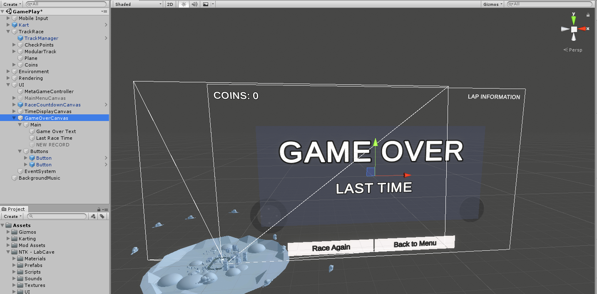

# Desarrollo del proyecto

Para el desarrollo del proyecto lo primero que he hecho ha sido descargar la demo/tutorial **Karting Microgame** y he eliminado los archivos de Tutorial para crear un nuevo proyecto de cero.

Luego he preparado un nuevo repositorio de Git y he actualizado el repositorio haciendo el primer commit con los archivos del proyecto.

## Estructura de carpetas ##

He reorganizado un poco la carpeta de proyecto, en la que destacan las siguientes carpetas: 

- **NTK - LabCave**: En esta carpeta he guardado todos los assets nuevos que he subido al proyecto, incluyendo scripts, imágenes, sonido, etc.
- **Plugins**: Carpeta de plugins de terceros del Asset Store
- **Scenes**: Escenas principales del juego

## Escena Start

Esta es la escena de inicio del juego.

El objeto **MainMenu** tiene un componente asociado con el mismo nombre que se encarga de inicializar los textos con el mejor tiempo y el total de monedas cuando se inicia la escena.

Para los botones del menú he creado un script adicional (**MenuButton**) para animar los botones la hacer click y lanzar una acción tras completarse la animación.

Para que todos los canvas se adapten a la pantalla del móvil independientemente de la resolución he usado esta configuración:

## Escena GamePlay

Esta es la escena de juego principal, es una copia de la escena de ejemplo de la demo pero recolocando algunos elementos de la ambientación. Además he reestructurado la estructura de la escena para ordenar mejor algunos elementos:

### Modificaciones en la escena

He cambiado completamente el Canvas de interfaz cuando se pone el juego en pausa pulsando la tecla "Escape".

Partiendo de este interfaz he creado también el UI para el final de la carrera.

He incluido varias monedas a lo largo de la pista cada una de estas monedas es un Prefab.

Las monedas se han incluido en el Tag "Coin" para buscarlas más facilmente cuando termina la partida

He incluido los controles para móviles y los he vinculado a los métodos de entrada del Kart creando un nuevo script y vinculando el nuevo script en Kart

Los controles para móvil pertenecen al plugin Simple Input del Assets Store y el script creado para el control de movimiento se llama **KartInput**

He incluido un objeto para controlar la cuenta de monedas recogidas por el jugador y producir un sonido cuando se recogen.

Este script también se encarga de pintar en pantalla el total de monedas recogidas durante la carrera.

### Modificaciones de código

**TimeDisplay**

Uno de los primeros archivos que he modificado ha sido la forma en la que se mostraban los tiempos. Para ello he cambiado el formato ".##" del fichero **TimeDisplay.cs** por "0.00" de esta manera el número de caracteres siempre es el mismo aunque el numero tenga menos decimales.

**MetaGameController**

He añadido funciones a este script para volver al menú principal o iniciar una nueva carrera usando los botones de la interfaz de Pausa o de GameOver.

**TrackManager**

En este script he añadido dos referencias a los objetos de la escena que se ocupan de mostrar los datos finales de la carrera. Una es la pantalla de GameOver y la otra el contador de monedas.

Además en la función de finalizar carrera (**StopRace**) he incluido las siguientes funcionalidades:

1. Mostrar el tiempo final de la carrera en la pantalla de GameOver
2. Comprobar si ha habido un nuevo record y si es así guardar el nuevo mejor tiempo y mostrar el mensaje de "NEW RECORD" en la pantalla de GameOver debajo del tiempo
3. Limpiar todas las monedas de la carrera para que no puedas cogerlas cuando terminas la carrera (Por si hay alguna moneda cerca de la meta)

### Scripts Nuevos

**CoinCounter**

Simplemente se encarga de contar las monedas de la carrera y lanzar un sonido cuando se recogen. Al mismo tiempo dibuja en pantalla el total de monedas usando un objeto de TextMeshPro referenciado en la escena.

**Coin**

Este script está presente en cada una de las monedas y se encarga de hacerlas rotar constantemente y de controlar la colisión con el jugador. Cuando una colisión se produce se llama al objeto CoinCounter.AddCoin para contabilizar la moneda. La moneda pasa a estado de letargo durante 10 segundos para que el jugador no pueda puntuarla de nuevo y pasado ese tiempo vuelve a reaparecer.

**KartInput**

Este script es una copia del script KartGame.KartSystems.KeyboardInput de la demo pero cambiando los controles para que sea compatible con Simple Input y el uso de teclado.

## Configuración para ARM64

Esta es la configuración que he usado para compilar el APK del juego para ARM64

## Bugs conocidos

1. En ocasiones al iniciar una carrera se pierde el sonido
2. En ocasiones el tiempo de carrera final pasa a ser el tiempo de la mejor vuelta, guardando un tiempo muy bajo en lugar del tiempo total de la carrera (Parece que es algo de la propia demo)

